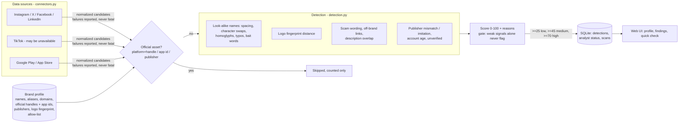

# Architecture

**How official assets are excluded:** the profile is checked before scoring. A candidate is dropped when its
platform+handle matches an official account, its app id matches an official app, or its publisher is an official
publisher. A name allow-list (e.g. "Acme Bakery") suppresses known harmless look-alikes. Analyst "dismissed" decisions persist across scans.

**Avoiding over-flagging:** name similarity is the primary signal. Contextual signals (publisher, account age, links, wording)
only add points when there is already name or logo evidence, and a harmless added word ("Acme Bank Fans") scores below the threshold.
